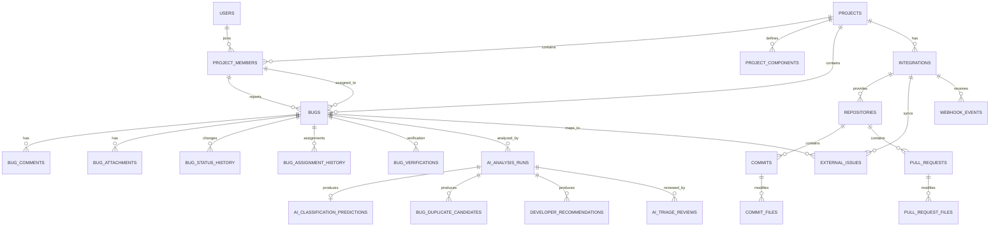

# BugNerve Database Schema

**Version:** 0.1  
**Status:** Initial Draft  
**Database:** PostgreSQL  
**Primary Keys:** UUID  
**Date/Time:** TIMESTAMPTZ  
**Naming Convention:** snake_case

## 1. Purpose

This document defines the initial relational database design for BugNerve.

The schema supports:
- Authentication and user accounts
- Project membership and roles
- Bug lifecycle management
- Comments, attachments, history, and verification
- AI triage and model version tracking
- Duplicate detection
- Developer recommendation
- GitHub / GitLab repository analysis
- Jira synchronization
- Notifications
- Audit logs

This schema is intentionally versioned as an initial Agile baseline and may evolve incrementally.

## 2. Core Design Principles

1. Final accepted bug values are stored separately from raw AI predictions.
2. A user may have a different role in each project.
3. AI analyses are versioned and repeatable.
4. Duplicate candidates and developer recommendations are one-to-many results.
5. Repository history is stored separately from application bug data.
6. External integration credentials must be encrypted.
7. Files are stored in object/file storage; PostgreSQL stores metadata and URLs.
8. Historical and audit data should be preserved rather than overwritten.

## 3. Enumerations

### project_role
- ADMIN
- TEAM_LEADER
- DEVELOPER
- TESTER

### bug_severity
- CRITICAL
- MAJOR
- NORMAL
- MINOR
- ENHANCEMENT

### bug_priority
- P1
- P2
- P3
- P4

### bug_status
- NEW
- AI_ANALYZING
- TRIAGE_REVIEW
- ASSIGNED
- IN_PROGRESS
- RESOLVED
- VERIFIED
- CLOSED
- REOPENED
- DUPLICATE
- REJECTED

### bug_source
- MANUAL
- JIRA
- GITHUB
- GITLAB

### verification_result
- PASSED
- FAILED

### duplicate_decision
- PENDING
- CONFIRMED
- REJECTED

### triage_decision
- ACCEPTED
- MODIFIED
- REJECTED

### ai_run_status
- PENDING
- RUNNING
- COMPLETED
- FAILED

### integration_provider
- GITHUB
- GITLAB
- JIRA

### integration_status
- CONNECTED
- DISCONNECTED
- ERROR
- EXPIRED

### pull_request_status
- OPEN
- MERGED
- CLOSED
- DRAFT

### sync_status
- PENDING
- SYNCED
- FAILED

### webhook_status
- RECEIVED
- PROCESSING
- PROCESSED
- FAILED

### bug_relation_type
- DUPLICATE_OF
- RELATED_TO
- BLOCKS
- BLOCKED_BY

## 4. Entity Relationship Overview



## 5. Tables

### 5.1 users

| Column | Type | Constraints / Notes |
|---|---|---|
| id | UUID | PK |
| first_name | VARCHAR(100) | NOT NULL |
| last_name | VARCHAR(100) | NOT NULL |
| email | VARCHAR(255) | NOT NULL, UNIQUE |
| password_hash | TEXT | NOT NULL |
| avatar_url | TEXT | NULL |
| is_active | BOOLEAN | NOT NULL DEFAULT TRUE |
| email_verified | BOOLEAN | NOT NULL DEFAULT FALSE |
| last_login_at | TIMESTAMPTZ | NULL |
| created_at | TIMESTAMPTZ | NOT NULL |
| updated_at | TIMESTAMPTZ | NOT NULL |

### 5.2 projects

| Column | Type | Constraints / Notes |
|---|---|---|
| id | UUID | PK |
| name | VARCHAR(150) | NOT NULL |
| project_key | VARCHAR(20) | NOT NULL, UNIQUE |
| description | TEXT | NULL |
| created_by | UUID | FK -> users.id |
| is_active | BOOLEAN | NOT NULL DEFAULT TRUE |
| created_at | TIMESTAMPTZ | NOT NULL |
| updated_at | TIMESTAMPTZ | NOT NULL |

### 5.3 project_members

| Column | Type | Constraints / Notes |
|---|---|---|
| id | UUID | PK |
| project_id | UUID | FK -> projects.id |
| user_id | UUID | FK -> users.id |
| role | project_role | NOT NULL |
| is_active | BOOLEAN | NOT NULL DEFAULT TRUE |
| joined_at | TIMESTAMPTZ | NOT NULL |

Unique constraint: `(project_id, user_id)`

### 5.4 project_components

| Column | Type | Constraints / Notes |
|---|---|---|
| id | UUID | PK |
| project_id | UUID | FK -> projects.id |
| name | VARCHAR(120) | NOT NULL |
| description | TEXT | NULL |
| created_at | TIMESTAMPTZ | NOT NULL |

Unique constraint: `(project_id, name)`

### 5.5 bugs

| Column | Type | Constraints / Notes |
|---|---|---|
| id | UUID | PK |
| project_id | UUID | FK -> projects.id |
| bug_number | BIGINT | project-local sequence |
| bug_key | VARCHAR(50) | UNIQUE |
| reporter_member_id | UUID | FK -> project_members.id |
| assigned_member_id | UUID | FK -> project_members.id, NULL |
| title | VARCHAR(300) | NOT NULL |
| description | TEXT | NOT NULL |
| steps_to_reproduce | TEXT | NULL |
| expected_result | TEXT | NULL |
| actual_result | TEXT | NULL |
| environment | JSONB | NULL |
| severity | bug_severity | NULL until assigned/finalized |
| priority | bug_priority | NULL until assigned/finalized |
| component_id | UUID | FK -> project_components.id, NULL |
| status | bug_status | NOT NULL |
| source | bug_source | NOT NULL DEFAULT MANUAL |
| created_at | TIMESTAMPTZ | NOT NULL |
| updated_at | TIMESTAMPTZ | NOT NULL |
| resolved_at | TIMESTAMPTZ | NULL |
| verified_at | TIMESTAMPTZ | NULL |
| closed_at | TIMESTAMPTZ | NULL |
| deleted_at | TIMESTAMPTZ | NULL |

Unique constraint: `(project_id, bug_number)`

### 5.6 bug_comments

| Column | Type |
|---|---|
| id | UUID PK |
| bug_id | UUID FK -> bugs.id |
| author_member_id | UUID FK -> project_members.id |
| content | TEXT |
| created_at | TIMESTAMPTZ |
| updated_at | TIMESTAMPTZ |
| deleted_at | TIMESTAMPTZ NULL |

### 5.7 bug_attachments

| Column | Type |
|---|---|
| id | UUID PK |
| bug_id | UUID FK -> bugs.id |
| uploaded_by | UUID FK -> project_members.id |
| file_name | VARCHAR(255) |
| original_name | VARCHAR(255) |
| storage_url | TEXT |
| mime_type | VARCHAR(100) |
| file_size | BIGINT |
| checksum | VARCHAR(128) NULL |
| created_at | TIMESTAMPTZ |

### 5.8 bug_status_history

| Column | Type |
|---|---|
| id | UUID PK |
| bug_id | UUID FK -> bugs.id |
| previous_status | bug_status NULL |
| new_status | bug_status |
| changed_by | UUID FK -> project_members.id |
| reason | TEXT NULL |
| changed_at | TIMESTAMPTZ |

### 5.9 bug_assignment_history

| Column | Type |
|---|---|
| id | UUID PK |
| bug_id | UUID FK -> bugs.id |
| previous_assignee_id | UUID FK -> project_members.id NULL |
| new_assignee_id | UUID FK -> project_members.id NULL |
| assigned_by | UUID FK -> project_members.id |
| reason | TEXT NULL |
| assigned_at | TIMESTAMPTZ |

### 5.10 bug_verifications

| Column | Type |
|---|---|
| id | UUID PK |
| bug_id | UUID FK -> bugs.id |
| tester_member_id | UUID FK -> project_members.id |
| result | verification_result |
| notes | TEXT NULL |
| verified_at | TIMESTAMPTZ |

### 5.11 bug_relations

| Column | Type |
|---|---|
| id | UUID PK |
| source_bug_id | UUID FK -> bugs.id |
| target_bug_id | UUID FK -> bugs.id |
| relation_type | bug_relation_type |
| created_by | UUID FK -> project_members.id |
| created_at | TIMESTAMPTZ |

### 5.12 ai_models

| Column | Type |
|---|---|
| id | UUID PK |
| name | VARCHAR(150) |
| model_type | VARCHAR(50) |
| version | VARCHAR(50) |
| artifact_uri | TEXT NULL |
| metrics | JSONB NULL |
| is_active | BOOLEAN |
| trained_at | TIMESTAMPTZ NULL |
| created_at | TIMESTAMPTZ |

### 5.13 ai_analysis_runs

| Column | Type |
|---|---|
| id | UUID PK |
| bug_id | UUID FK -> bugs.id |
| status | ai_run_status |
| triggered_by | UUID FK -> project_members.id NULL |
| started_at | TIMESTAMPTZ |
| completed_at | TIMESTAMPTZ NULL |
| error_message | TEXT NULL |
| created_at | TIMESTAMPTZ |

### 5.14 ai_classification_predictions

| Column | Type |
|---|---|
| id | UUID PK |
| analysis_run_id | UUID FK -> ai_analysis_runs.id |
| severity_model_id | UUID FK -> ai_models.id NULL |
| predicted_severity | bug_severity NULL |
| severity_confidence | NUMERIC(5,4) NULL |
| priority_model_id | UUID FK -> ai_models.id NULL |
| predicted_priority | bug_priority NULL |
| priority_confidence | NUMERIC(5,4) NULL |
| component_model_id | UUID FK -> ai_models.id NULL |
| predicted_component_id | UUID FK -> project_components.id NULL |
| component_confidence | NUMERIC(5,4) NULL |
| created_at | TIMESTAMPTZ |

Recommended unique constraint: `(analysis_run_id)`

### 5.15 bug_duplicate_candidates

| Column | Type |
|---|---|
| id | UUID PK |
| analysis_run_id | UUID FK -> ai_analysis_runs.id |
| bug_id | UUID FK -> bugs.id |
| candidate_bug_id | UUID FK -> bugs.id |
| similarity_score | NUMERIC(5,4) |
| rank | INTEGER |
| decision | duplicate_decision DEFAULT PENDING |
| reviewed_by | UUID FK -> project_members.id NULL |
| reviewed_at | TIMESTAMPTZ NULL |
| created_at | TIMESTAMPTZ |

### 5.16 developer_recommendations

| Column | Type |
|---|---|
| id | UUID PK |
| analysis_run_id | UUID FK -> ai_analysis_runs.id |
| developer_member_id | UUID FK -> project_members.id |
| rank | INTEGER |
| component_score | NUMERIC(5,4) NULL |
| file_history_score | NUMERIC(5,4) NULL |
| similar_bug_score | NUMERIC(5,4) NULL |
| workload_score | NUMERIC(5,4) NULL |
| recent_activity_score | NUMERIC(5,4) NULL |
| final_score | NUMERIC(5,4) |
| explanation | JSONB NULL |
| created_at | TIMESTAMPTZ |

### 5.17 ai_triage_reviews

| Column | Type |
|---|---|
| id | UUID PK |
| analysis_run_id | UUID FK -> ai_analysis_runs.id |
| reviewed_by | UUID FK -> project_members.id |
| decision | triage_decision |
| final_severity | bug_severity NULL |
| final_priority | bug_priority NULL |
| final_component_id | UUID FK -> project_components.id NULL |
| selected_developer_id | UUID FK -> project_members.id NULL |
| review_notes | TEXT NULL |
| reviewed_at | TIMESTAMPTZ |

### 5.18 integrations

| Column | Type |
|---|---|
| id | UUID PK |
| project_id | UUID FK -> projects.id |
| provider | integration_provider |
| external_account_id | VARCHAR(255) NULL |
| display_name | VARCHAR(255) NULL |
| access_token_encrypted | TEXT NULL |
| refresh_token_encrypted | TEXT NULL |
| expires_at | TIMESTAMPTZ NULL |
| status | integration_status |
| settings | JSONB NULL |
| last_synced_at | TIMESTAMPTZ NULL |
| created_at | TIMESTAMPTZ |
| updated_at | TIMESTAMPTZ |

### 5.19 external_identities

| Column | Type |
|---|---|
| id | UUID PK |
| user_id | UUID FK -> users.id NULL |
| provider | integration_provider |
| external_user_id | VARCHAR(255) |
| username | VARCHAR(255) |
| email | VARCHAR(255) NULL |
| avatar_url | TEXT NULL |
| created_at | TIMESTAMPTZ |

### 5.20 repositories

| Column | Type |
|---|---|
| id | UUID PK |
| project_id | UUID FK -> projects.id |
| integration_id | UUID FK -> integrations.id |
| external_id | VARCHAR(255) |
| name | VARCHAR(255) |
| full_name | VARCHAR(500) |
| url | TEXT |
| default_branch | VARCHAR(255) NULL |
| is_private | BOOLEAN |
| last_synced_at | TIMESTAMPTZ NULL |
| created_at | TIMESTAMPTZ |

### 5.21 repository_branches

| Column | Type |
|---|---|
| id | UUID PK |
| repository_id | UUID FK -> repositories.id |
| name | VARCHAR(255) |
| head_sha | VARCHAR(64) NULL |
| is_default | BOOLEAN |
| last_seen_at | TIMESTAMPTZ NULL |

### 5.22 commits

| Column | Type |
|---|---|
| id | UUID PK |
| repository_id | UUID FK -> repositories.id |
| sha | VARCHAR(64) |
| author_external_identity_id | UUID FK -> external_identities.id NULL |
| matched_user_id | UUID FK -> users.id NULL |
| author_name | VARCHAR(255) NULL |
| author_email | VARCHAR(255) NULL |
| message | TEXT |
| committed_at | TIMESTAMPTZ |
| created_at | TIMESTAMPTZ |

Unique constraint: `(repository_id, sha)`

### 5.23 commit_files

| Column | Type |
|---|---|
| id | UUID PK |
| commit_id | UUID FK -> commits.id |
| file_path | TEXT |
| previous_path | TEXT NULL |
| additions | INTEGER DEFAULT 0 |
| deletions | INTEGER DEFAULT 0 |
| changes | INTEGER DEFAULT 0 |
| change_type | VARCHAR(50) NULL |

### 5.24 pull_requests

| Column | Type |
|---|---|
| id | UUID PK |
| repository_id | UUID FK -> repositories.id |
| external_id | VARCHAR(255) |
| number | INTEGER |
| title | VARCHAR(500) |
| description | TEXT NULL |
| author_identity_id | UUID FK -> external_identities.id NULL |
| source_branch | VARCHAR(255) |
| target_branch | VARCHAR(255) |
| status | pull_request_status |
| url | TEXT |
| opened_at | TIMESTAMPTZ |
| merged_at | TIMESTAMPTZ NULL |
| closed_at | TIMESTAMPTZ NULL |

### 5.25 pull_request_files

| Column | Type |
|---|---|
| id | UUID PK |
| pull_request_id | UUID FK -> pull_requests.id |
| file_path | TEXT |
| additions | INTEGER DEFAULT 0 |
| deletions | INTEGER DEFAULT 0 |
| changes | INTEGER DEFAULT 0 |

### 5.26 repository_contributors

| Column | Type |
|---|---|
| id | UUID PK |
| repository_id | UUID FK -> repositories.id |
| external_identity_id | UUID FK -> external_identities.id |
| commit_count | INTEGER DEFAULT 0 |
| additions | BIGINT DEFAULT 0 |
| deletions | BIGINT DEFAULT 0 |
| last_activity_at | TIMESTAMPTZ NULL |

### 5.27 developer_component_stats

| Column | Type |
|---|---|
| id | UUID PK |
| project_member_id | UUID FK -> project_members.id |
| component_id | UUID FK -> project_components.id |
| commit_count | INTEGER DEFAULT 0 |
| resolved_bug_count | INTEGER DEFAULT 0 |
| similar_bug_count | INTEGER DEFAULT 0 |
| expertise_score | NUMERIC(5,4) NULL |
| last_updated_at | TIMESTAMPTZ |

### 5.28 developer_file_stats

| Column | Type |
|---|---|
| id | UUID PK |
| project_member_id | UUID FK -> project_members.id |
| repository_id | UUID FK -> repositories.id |
| file_path | TEXT |
| commit_count | INTEGER DEFAULT 0 |
| additions | BIGINT DEFAULT 0 |
| deletions | BIGINT DEFAULT 0 |
| ownership_score | NUMERIC(5,4) NULL |
| last_modified_at | TIMESTAMPTZ NULL |

### 5.29 external_issues

| Column | Type |
|---|---|
| id | UUID PK |
| bug_id | UUID FK -> bugs.id |
| integration_id | UUID FK -> integrations.id |
| provider | integration_provider |
| external_issue_id | VARCHAR(255) |
| external_key | VARCHAR(255) |
| url | TEXT NULL |
| sync_status | sync_status |
| last_external_update_at | TIMESTAMPTZ NULL |
| last_synced_at | TIMESTAMPTZ NULL |
| created_at | TIMESTAMPTZ |

### 5.30 sync_jobs

| Column | Type |
|---|---|
| id | UUID PK |
| integration_id | UUID FK -> integrations.id |
| job_type | VARCHAR(100) |
| status | VARCHAR(50) |
| started_at | TIMESTAMPTZ |
| completed_at | TIMESTAMPTZ NULL |
| records_processed | INTEGER DEFAULT 0 |
| error_message | TEXT NULL |

### 5.31 webhook_events

| Column | Type |
|---|---|
| id | UUID PK |
| integration_id | UUID FK -> integrations.id |
| provider | integration_provider |
| event_type | VARCHAR(150) |
| external_event_id | VARCHAR(255) |
| payload | JSONB |
| status | webhook_status |
| attempts | INTEGER DEFAULT 0 |
| received_at | TIMESTAMPTZ |
| processed_at | TIMESTAMPTZ NULL |
| error_message | TEXT NULL |

Unique constraint: `(provider, external_event_id)`

### 5.32 notifications

| Column | Type |
|---|---|
| id | UUID PK |
| user_id | UUID FK -> users.id |
| project_id | UUID FK -> projects.id NULL |
| type | VARCHAR(100) |
| title | VARCHAR(255) |
| message | TEXT |
| reference_type | VARCHAR(100) NULL |
| reference_id | UUID NULL |
| is_read | BOOLEAN DEFAULT FALSE |
| read_at | TIMESTAMPTZ NULL |
| created_at | TIMESTAMPTZ |

### 5.33 refresh_tokens

| Column | Type |
|---|---|
| id | UUID PK |
| user_id | UUID FK -> users.id |
| token_hash | TEXT |
| expires_at | TIMESTAMPTZ |
| revoked_at | TIMESTAMPTZ NULL |
| user_agent | TEXT NULL |
| ip_address | INET NULL |
| created_at | TIMESTAMPTZ |

### 5.34 password_reset_tokens

| Column | Type |
|---|---|
| id | UUID PK |
| user_id | UUID FK -> users.id |
| token_hash | TEXT |
| expires_at | TIMESTAMPTZ |
| used_at | TIMESTAMPTZ NULL |
| created_at | TIMESTAMPTZ |

### 5.35 audit_logs

| Column | Type |
|---|---|
| id | UUID PK |
| user_id | UUID FK -> users.id NULL |
| project_id | UUID FK -> projects.id NULL |
| action | VARCHAR(150) |
| entity_type | VARCHAR(100) |
| entity_id | UUID NULL |
| old_values | JSONB NULL |
| new_values | JSONB NULL |
| ip_address | INET NULL |
| created_at | TIMESTAMPTZ |

## 6. Optional Vector Storage

If PostgreSQL pgvector is selected for semantic duplicate search, add:

### bug_embeddings

| Column | Type |
|---|---|
| id | UUID PK |
| bug_id | UUID FK -> bugs.id |
| model_id | UUID FK -> ai_models.id |
| embedding | VECTOR(N) |
| created_at | TIMESTAMPTZ |

`N` must be selected after the embedding model is finalized. It should not be hard-coded during initial design.

## 7. Important Indexes

Recommended indexes:

```sql
CREATE INDEX idx_bugs_project_id ON bugs(project_id);
CREATE INDEX idx_bugs_status ON bugs(status);
CREATE INDEX idx_bugs_priority ON bugs(priority);
CREATE INDEX idx_bugs_severity ON bugs(severity);
CREATE INDEX idx_bugs_component_id ON bugs(component_id);
CREATE INDEX idx_bugs_assigned_member_id ON bugs(assigned_member_id);
CREATE INDEX idx_bug_comments_bug_id ON bug_comments(bug_id);
CREATE INDEX idx_bug_status_history_bug_id ON bug_status_history(bug_id);
CREATE INDEX idx_ai_analysis_runs_bug_id ON ai_analysis_runs(bug_id);
CREATE INDEX idx_duplicate_candidates_bug_id ON bug_duplicate_candidates(bug_id);
CREATE INDEX idx_developer_recommendations_run_id ON developer_recommendations(analysis_run_id);
CREATE INDEX idx_commits_repository_id ON commits(repository_id);
CREATE INDEX idx_commit_files_commit_id ON commit_files(commit_id);
CREATE INDEX idx_external_issues_external_key ON external_issues(external_key);
CREATE INDEX idx_webhook_events_status ON webhook_events(status);
CREATE INDEX idx_notifications_user_read ON notifications(user_id, is_read);
```

Additional production indexes shall be driven by query profiling.

## 8. Delete / Retention Strategy

Use soft deletion or deactivation for business entities where historical integrity matters:
- users -> is_active
- projects -> is_active
- bugs -> deleted_at

Short-lived security records may be physically removed after expiration:
- refresh_tokens
- password_reset_tokens

Webhook payload retention should be configurable.

## 9. File Storage

Binary files should not be stored directly in PostgreSQL for the normal application flow.

Recommended approach:
- Object/file storage for file contents
- `bug_attachments` for metadata and secure storage reference

Allowed file types, size limits, authorization, and malware/content validation shall be enforced by the application layer.

## 10. AI Dataset Separation

Public training datasets such as Eclipse historical bug data are AI/data-engineering assets and should not be mixed directly with the production application database.

Recommended AI repository layout:

```text
data/
├── raw/
├── processed/
├── splits/
│   ├── train/
│   ├── validation/
│   └── test/
└── metadata/
```

CSV and/or Parquet are suitable initial storage formats for offline model training.

## 11. Incremental Implementation Plan

### Phase 1 — Core Platform
- users
- projects
- project_members
- project_components
- bugs
- bug_comments
- bug_attachments
- bug_status_history
- bug_assignment_history
- bug_verifications
- refresh_tokens
- password_reset_tokens

### Phase 2 — AI Triage
- ai_models
- ai_analysis_runs
- ai_classification_predictions
- bug_duplicate_candidates
- developer_recommendations
- ai_triage_reviews
- optional bug_embeddings

### Phase 3 — Git Intelligence
- integrations
- external_identities
- repositories
- repository_branches
- commits
- commit_files
- pull_requests
- pull_request_files
- repository_contributors
- developer_component_stats
- developer_file_stats

### Phase 4 — Jira / Sync / Operations
- external_issues
- sync_jobs
- webhook_events
- notifications
- audit_logs

## 12. Final Notes

- The schema stores accepted human-reviewed values in `bugs`.
- AI outputs remain preserved in AI-specific tables.
- The architecture supports repeated model runs without destroying previous results.
- Developer recommendation evidence is preserved independently from final assignment.
- The schema supports GitHub, GitLab, and Jira without hard-coding provider-specific core entities.
- The schema should be reviewed during implementation and updated incrementally rather than treated as immutable.
